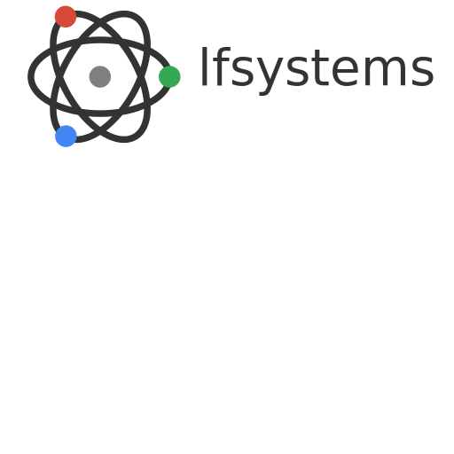

# Nginxy

## Directory Listing Theme (Modernized Version)


[](https://github.com/lfelipe1501/Nginxy/issues)

A modernized responsive theme for the [Nginx Fancyindex module](https://github.com/aperezdc/ngx-fancyindex). A minimalist, modern, and simple directory listing theme for **nginx** with an appearance similar to Apaxy for Apache.

Here is a demo of what the result looks like: [lfsystems DEMO](https://www.lfsystems.com.co/fileserver/).


## Features of the Modernized Version

- **No jQuery dependencies**: Modern and native JavaScript code
- **Fully responsive design**: Optimized for mobile and desktop devices
- **Modern theme**: Clean and modern interface with customizable colors
- **Colored Material Design SVG icons**: Modern, scalable vector icons with specific colors for each file type
- **Light and dark theme support**: Automatically adapts to browser preference
- **Wide format support**: Includes icons for more than 40 different file types

## Usage

- Make sure you have the [Fancyindex module](https://github.com/aperezdc/ngx-fancyindex) compiled with nginx, either by compiling it yourself or installing nginx through the full distribution (nginx-extras package).

- Include the contents of **nginxy.conf** in your location directive (location / {.....}) in your nginx configuration (usually nginx.conf).

- Move the *Nginxy-Theme/* folder to a directory before the folder that will serve the files and rename it to **.nginxy/** As shown in the following screenshot:

  

- Restart/reload nginx.

- Check that it works and enjoy!

## Customization

### Colors and Themes

You can easily customize the theme by modifying the CSS variables in the `style.css` file:

```css
/* Light Theme Variables (default) */
:root, .light-theme {
    --primary-color: #4a6cf7;
    --secondary-color: #6c757d;
    --background-color: #ffffff;
    --text-color: #333333;
    --border-color: #e9ecef;
    --hover-color: #f8f9fa;
    --header-color: #343a40;
    --footer-color: #f8f9fa;
    --icon-size: 24px;
    --table-header-bg: #4a6cf7;
    --table-header-color: #ffffff;
    --table-shadow: rgba(0, 0, 0, 0.05);
    --icon-opacity: 1;
}

/* Dark Theme Variables */
.dark-theme {
    --primary-color: #6d8eff;
    --secondary-color: #adb5bd;
    --background-color: #121212;
    --text-color: #e0e0e0;
    --border-color: #2d2d2d;
    --hover-color: #1e1e1e;
    --header-color: #e0e0e0;
    --footer-color: #1a1a1a;
    --table-header-bg: #2d2d2d;
    --table-header-color: #e0e0e0;
    --table-shadow: rgba(0, 0, 0, 0.2);
    --icon-opacity: 0.9;
}
```

### Colored Material Design SVG Icons

This version uses Material Design SVG Icons through a CDN, with specific colors for each file type. You can customize the icons and their colors by modifying the mapping in the `config.js` file:

```javascript
// Material Design Icons CDN
const iconsCDN = 'https://cdn.jsdelivr.net/npm/@mdi/svg@7.2.96/svg/';

// Mapping file extensions to Material Design Icons with colors
const iconMap = {
    // Folders and navigation
    'folder': { icon: 'folder', color: '#ffc107' },
    'home': { icon: 'home', color: '#4caf50' },
    'error': { icon: 'file-alert', color: '#f44336' },
    
    // Documents
    'doc': { icon: 'file-word', color: '#2196f3' },
    'docx': { icon: 'file-word', color: '#2196f3' },
    'txt': { icon: 'file-document', color: '#607d8b' },
    'pdf': { icon: 'file-pdf-box', color: '#f44336' },
    'csv': { icon: 'file-delimited', color: '#4caf50' },
    'log': { icon: 'file-document-outline', color: '#607d8b' },
    'json': { icon: 'code-json', color: '#ffc107' },
    // ... more icon mappings
};
```

#### Supported File Formats

The theme includes icons for the following file types:

- **Documents**: doc, docx, txt, pdf, ppt, pptx, xls, xlsx, csv, log, json
- **Images**: jpg, jpeg, png, gif, bmp, tiff, ico, svg, psd, raw
- **Audio/Video**: mp3, wav, ogg, wma, mp4, avi, wmv
- **Compressed files**: zip, rar, 7z, tar, gz, gzip, deb, iso
- **Code**: html, css, js, php, py, java, jar, c, c++, sql, sh, bat, cmd
- **Executables and others**: exe, bin, swf, torrent, msg

You can find more available icons at [Material Design Icons](https://materialdesignicons.com/).

### Contact / Social Media

#### Get the latest news about web development, open source, tools, servers, and security

[](https://twitter.com/lfelipe1501)
[](https://www.facebook.com/lfelipe1501)
[](https://github.com/lfelipe1501)

### Developed by

Developer / Author: [Luis Felipe Sánchez](https://github.com/lfelipe1501)
Company: [lfsystems](https://www.lfsystems.com.co)

### Credits

Based on [apaxy](https://github.com/AdamWhitcroft/Apaxy) by Adam Whitcroft
Modernized version: 2023
